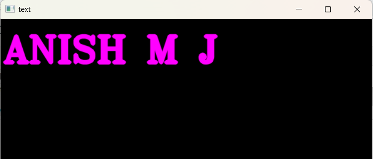
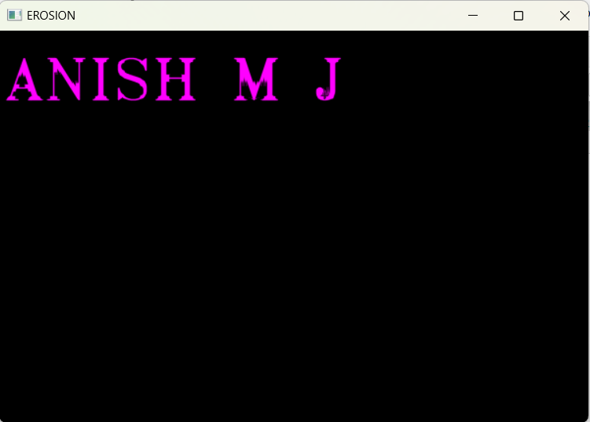
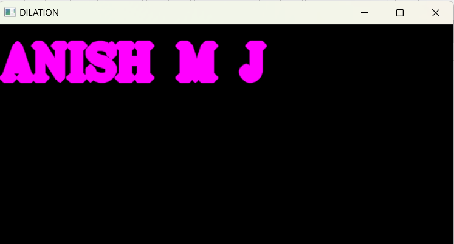

# Implementation-of-Erosion-and-Dilation
## Aim
To implement Erosion and Dilation using Python and OpenCV.
## Software Required
1. Anaconda - Python 3.7
2. OpenCV
## Algorithm:
### Step1:
Import necessary packages


### Step2:
Create a empty window and add text in it

### Step3:
Create a structuring element

### Step4:
Do the operation

### Step5:
Do the operation

 
## Program:

``` Python
DEVELOPED BY : ANISH MJ
REGISTER NO : 212221230005

# Import the necessary packages
import cv2
import numpy as np


# Create the Text using cv2.putText
img = np.zeros((400,600),dtype = 'uint8')
img = cv2.cvtColor(img,cv2.COLOR_RGB2BGR)
font = cv2.FONT_HERSHEY_TRIPLEX
cv2.putText(img,'ANISH M J',(5,70),font,2,(255,0,255),5,cv2.LINE_AA)
   


# Create the structuring element
img = np.zeros((400,600),dtype = 'uint8')
img = cv2.cvtColor(img,cv2.COLOR_RGB2BGR)


# Erode the image
kernel1 = cv2.getStructuringElement(cv2.MORPH_CROSS,(7,7))
erode = cv2.erode(img,kernel1)
cv2.imshow("EROSION",erode)
cv2.waitKey(0)
cv2.destroyAllWindows()


# Dilate the image

dilate = cv2.dilate(img,kernel1)
cv2.imshow("DILATION",dilate)
cv2.waitKey(0)
cv2.destroyAllWindows()


```
## Output:

### Display the input Image

### Display the Eroded Image


### Display the Dilated Image


## Result
Thus the generated text image is eroded and dilated using python and OpenCV.